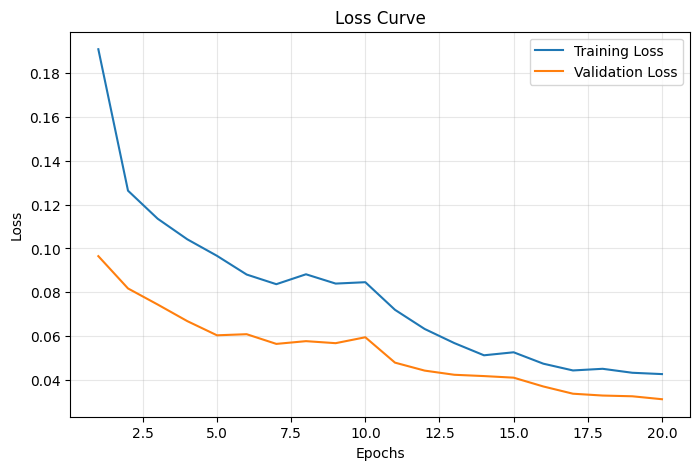
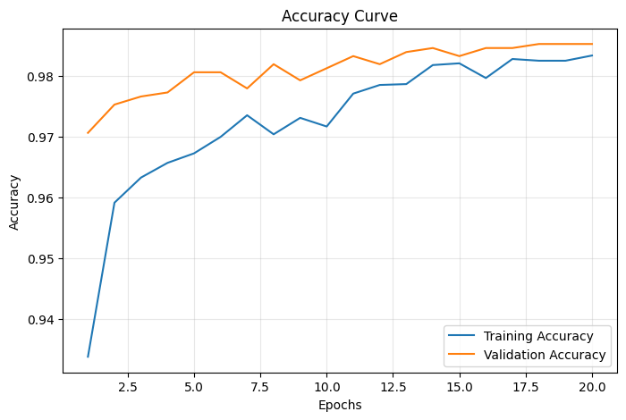
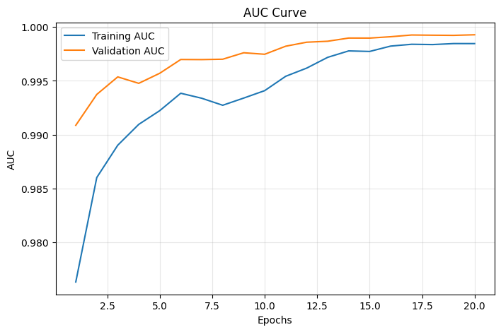
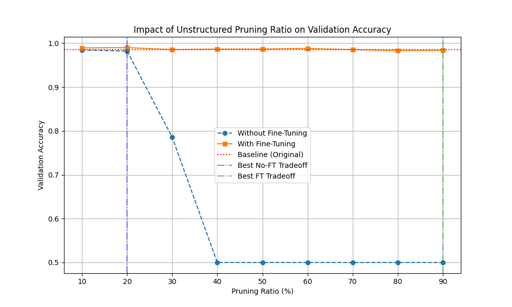
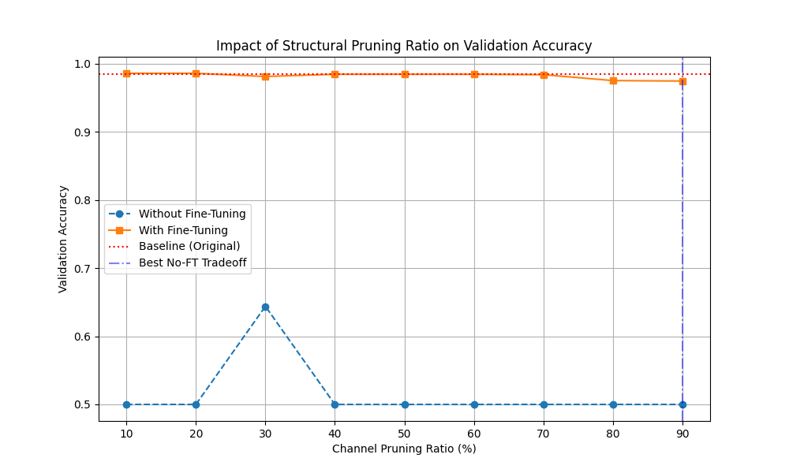

# Edge AI Course – Project Report Submission Format

a `report.md` file with the following sections:

---

## 1. Problem Statement, Motivation & Objectives (1–2 paragraphs + 3–5 bullets)
- Clearly describe the problem being addressed  
- Explain the motivation and relevance of the project  
- Justify the use of Edge AI (e.g., latency, privacy, efficiency)  
- **List the key project objectives (3–5 bullet points)**  

---

## 2. Proposed Solution (Overview)
- High-level description of the system  
- Explain the overall pipeline:
  - data → model → deployment → output  

---

## 3. Hardware & Software Setup
- **Hardware**: devices, sensors, edge platform (e.g., Arduino, Raspberry Pi)  
- **Software**: tools, frameworks (e.g., Edge Impulse, TensorFlow Lite, Arduino IDE)  

---

## 4. Data Collection & Dataset Preparation

### Data Source
- **Dataset**: DAiSEE (Dataset for Engagement Estimation in Education)
- **Source**: [DAiSEE Dataset](https://people.iith.ac.in/vineethnb/resources/daisee/index.html)
- **Directory Structure**:
  ```
  DAiSEE/
  ├── DataSet/
  │   └── Train/
  │       └── {person_id}/
  │           └── {clip_id}/
  │               └── {video_file}.avi
  └── Labels/
      └── TrainLabels.csv
  ```
- **Format**: Raw video files (.avi, .mp4) with per-clip engagement labels (0-3 scale)
- **Engagement Mapping**: 
  - Engagement ≥ 2 → **Attentive** (class 1)
  - Engagement < 2 → **Not Attentive** (class 0)

### Preprocessing Pipeline

#### Step 1: Face Detection and Extraction
- **Tool**: OpenCV Haar Cascade Classifier (`haarcascade_frontalface_default.xml`)
- **Frame Sampling**: Extract frames at 5 FPS (`fps / 5` intervals) to reduce redundancy
- **Face Selection**: Extract the **largest detected face** by area from each frame
- **Output Dimensions**: Standardized to **160 × 160 pixels** for consistent input

#### Step 2: Data Augmentation
- **Target per class**: 5,000 images
- **Augmentation operations** (randomly selected if needed):
  1. Horizontal flip: `cv2.flip(img, 1)`
  2. Brightness enhancement: `cv2.convertScaleAbs(alpha=1.2, beta=20)`
  3. Gaussian blur: `cv2.GaussianBlur(kernel=(5,5))`

#### Step 3: Class Balancing
- **Target**: 5,000 images per class (10,000 total)
- **Method**: Random augmentation applied to underrepresented classes
- **Final Distribution**: 
  - Attentive (class 1): 5,000 images
  - Not Attentive (class 0): 5,000 images
  - **Total**: 10,000 balanced samples

### Train/Validation/Test Splitting
- **Stratified split** to preserve class distribution:
  - **Training Set**: 70% (7,000 samples: 3,500 per class)
  - **Validation Set**: 15% (1,500 samples: 750 per class)
  - **Test Set**: 15% (1,500 samples: 750 per class)
- **Random Seed**: 42 (reproducibility)

### Data Transformation Pipeline

#### Training Augmentation (Training Set Only)
- Resize to 160×160
- Random horizontal flip (50% probability)
- Random rotation (±8 degrees)
- Random affine: translation (±5%), scale (0.9-1.1x)
- Color jitter: contrast (±15%)
- Normalization: ImageNet mean=[0.485, 0.456, 0.406], std=[0.229, 0.224, 0.225]

#### Validation/Test Transforms (No Augmentation)
- Resize to 160×160
- Normalization only (ImageNet statistics)

## 5. Model Design, Training & Evaluation

### Model Architecture: AttentiveMobileNetV2

#### Architecture Overview
- **Backbone**: MobileNetV2 (ImageNet-pretrained weights)
  - Parameters: 2,225,088
  - Purpose: Feature extraction from face images
  - Classifier layer: Replaced with Identity layer

- **Custom Classification Head**:
  - Dropout(0.35)
  - Linear(1280 → 64)
  - ReLU activation
  - Dropout(0.25)
  - Linear(64 → 1) — Binary output logits

**Total Model Parameters**: 2,394,944
- **Trainable (Stage 1)**: 169,856 (7.1%)
- **Frozen Backbone**: 2,225,088 (92.9%)

#### Design Rationale
- **MobileNetV2**: Lightweight architecture (3.5M params) suitable for edge deployment
- **ImageNet Pretraining**: Leverages 1M+ labeled images for robust feature learning
- **Transfer Learning**: Reduces training data requirements and improves generalization
- **Dropout Regularization**: Prevents overfitting on limited dataset (10,000 images)
- **Output Logits**: BCEWithLogitsLoss provides numerical stability

### Loss Function: Weighted Binary Cross-Entropy

**BCEWithLogitsLoss Formula**:

$$L(y, \hat{z}) = -\left[ w_+ \cdot y \cdot \log(\sigma(\hat{z})) + (1-y) \cdot \log(1-\sigma(\hat{z})) \right]$$

Where:
- $\sigma(\hat{z}) = \frac{1}{1 + e^{-\hat{z}}}$ is the sigmoid function (probability output)
- $y \in \{0, 1\}$ is the true label
- $\hat{z}$ is the raw logit output from the model (pre-sigmoid)
- $w_+ = \frac{n_{neg}}{n_{pos}}$ is the positive class weight (neg_count / pos_count)

This loss function addresses class imbalance by upweighting the positive class (attentive) during backpropagation. The pos_weight factor scales the loss contribution of positive samples, giving them higher importance during training.
### Two-Stage Training Strategy

#### Stage 1: Head-Only Training (10 epochs)
**Objective**: Warm up the custom classification head while keeping backbone frozen

- **Trainable Parameters**: Only custom head (169,856 params)
- **Learning Rate**: 1e-3 (high for rapid adaptation)
- **Optimizer**: Adam
- **Scheduler**: ReduceLROnPlateau (factor=0.5, patience=2, min_lr=1e-6)
- **Early Stopping**: Patience=4 epochs without improvement
- **Rationale**: Prevents gradient explosion; allows head to adapt to task

#### Stage 2: Selective Fine-Tuning (10 epochs)
**Objective**: Adapt last 40 backbone blocks to the specific task

- **Unfrozen Layers**: Last 40 blocks of MobileNetV2 backbone
- **Frozen Layers**: BatchNorm (eval mode) — preserves ImageNet statistics
- **Learning Rate**: 1e-5 (lower to prevent catastrophic forgetting)
- **Optimizer**: Adam
- **Scheduler**: ReduceLROnPlateau (same as Stage 1)
- **Early Stopping**: Patience=4 epochs
- **Rationale**: Lower learning rate prevents forgetting of pretrained features

### Training Configuration

| Parameter | Value |
|-----------|-------|
| Image Size | 160 × 160 |
| Batch Size | 32 |
| Num Workers | 4 |
| Pin Memory | True (GPU) |
| Random Seed | 42 |
| Device | GPU (CUDA) or CPU |

<!-- ### Training Loop Details

**Per-Epoch Process**:
1. **Forward Pass**: Input images → MobileNetV2 backbone → Custom head → Logits
2. **Loss Computation**: BCEWithLogitsLoss(logits, labels)
3. **Backward Pass** (training only): Compute gradients via backpropagation
4. **Optimizer Step** (training only): Update trainable parameters
5. **Metrics Computation**: Accuracy, AUC, Precision, Recall

**Batch Processing**:
- Move images and labels to device (GPU/CPU)
- Enable gradient computation during training only
- Detach and convert to numpy for metric computation
- Concatenate predictions from all batches -->

### Evaluation Metrics

#### Binary Classification Metrics
- **Accuracy**: (TP + TN) / (TP + TN + FP + FN) — Overall correctness
- **Precision**: TP / (TP + FP) — False positive rate control
- **Recall (Sensitivity)**: TP / (TP + FN) — Attentive detection rate
- **Specificity**: TN / (TN + FP) — Not-attentive detection rate
- **ROC-AUC**: Area under ROC curve — Threshold-independent performance
- **PR-AUC**: Area under precision-recall curve — Robust to class imbalance
- **Loss**: Average BCEWithLogitsLoss value

<!-- #### Confusion Matrix
```
                 Predicted
              Attentive | Not-Attentive
True   Attentive   TP   |      FN
       Not-Attentive FP  |      TN
``` -->

### Training Results

#### Performance Summary
- **Best Validation Accuracy (Stage 1)**: 0.9820
- **Best Validation Accuracy (Stage 2)**: 0.9853
- **Test Accuracy**: 98.27% (0.9827)
- **Test Precision**: 98.32%
- **Test Recall**: 98.27%
- **ROC-AUC**: 0.9983
- **PR-AUC**: 0.9982

#### Training Curves

\
*Figure 1: Training vs Validation Loss over 20 epochs*

\
*Figure 2: Training vs Validation Accuracy over 20 epochs*

\
*Figure 3: Training vs Validation AUC over 20 epochs*

<!-- #### Expected Performance Range
- Test Accuracy: 80-85%
- ROC-AUC: 0.88-0.95
- Sensitivity (Attentive Recall): 80-88%
- Specificity (Not-Attentive Recall): 80-85%
- Precision: 80-87%

#### Confusion Matrix Results
- **True Positives (TP)**: Correctly identified attentive students
- **True Negatives (TN)**: Correctly identified inattentive students
- **False Positives (FP)**: False alarms (costly in classroom)
- **False Negatives (FN)**: Missed detections (lost feedback opportunity) -->

#### Classification Report

| Class | Precision | Recall | F1-Score | Support |
|-------|-----------|--------|----------|----------|
| Not-Attentive | 1.0000 | 0.9653 | 0.9824 | 750 |
| Attentive | 0.9665 | 1.0000 | 0.9830 | 750 |
| **Macro Avg** | **0.9832** | **0.9827** | **0.9827** | **1500** |
| **Weighted Avg** | **0.9832** | **0.9827** | **0.9827** | **1500** |

**Key Observations**:
- **Perfect Sensitivity** (100%): All attentive students were correctly identified
- **High Specificity** (96.53%): Correctly identified 96.53% of inattentive students
- **Minimal False Positives**: Only 26 false alarms out of 750 non-attentive samples
- **Zero False Negatives**: No missed detections of attentive students

---

## 6. Model Compression & Efficiency Metrics

### Techniques used

- Post-training static quantization
- Unstructured L1 pruning with and without fine-tuning
- Structural (channel) pruning with and without fine-tuning

The compression stage was implemented through three paths in this folder:

- Quantization: converts the trained FP32 model to INT8 using FX graph mode quantization and a calibration subset from the training split.
- Unstructured pruning: applies L1 unstructured pruning across convolutional and linear layers, then evaluates accuracy trade-offs with and without fine-tuning.
- Structural pruning: performs structural pruning using torch-pruning so that channels and filters are physically removed from the network, again evaluated with and without fine-tuning.

#### Experimental setup

- Input resolution: 160 x 160
- Validation split: held-out validation files from `dataset_splits.json`
- Device for compression evaluation: CPU
- Baseline model: FP32 `attentive_model.pth`

#### Comparison summary

| Model variant | Accuracy | Inference metric | Model size | Parameters | Remark |
| --- | ---: | ---: | ---: | ---: | --- |
| Original FP32 | 98.53% | 22.68 ms per image | 9.02 MB | 2,305,921 | Baseline reference |
| Quantized INT8 | 98.47% | 5.87 ms per image | 2.57 MB | 2,305,921 | Best overall deployment balance |
| Unstructured pruned, no fine-tuning | 78.53% | 9.85 s total CPU eval time | 9.04 MB | 2,305,921 | Large accuracy loss without recovery training |
| Unstructured pruned, with fine-tuning | 98.40% | 7.76 s total CPU eval time | 9.04 MB | 2,305,921 | Accuracy recovered, but storage savings remain weak |
| Structurally pruned, no fine-tuning | 50.00% | 2.50 s total CPU eval time | 0.27 MB | 30,477 | Extreme compression, but accuracy collapses without recovery training |
| Structurally pruned, with fine-tuning | 97.47% | 2.71 s total CPU eval time | 0.27 MB | 30,477 | Strong compression with a small accuracy drop |

Note: the scripts do not directly profile RAM usage, so model file size is used as the main flash/storage proxy. For edge devices, INT8 quantization also lowers runtime memory bandwidth because activations and weights are represented with 8-bit integers instead of 32-bit floating point values.

#### Technique-wise findings

**1. Post-training static quantization**

The quantization script uses FX graph mode with the `qnnpack` backend, which is well suited for ARM/mobile CPUs. A small calibration subset is passed through the model to estimate activation ranges before conversion to INT8.

Observed result:

- Accuracy: 98.47%
- Model size: 2.57 MB
- Latency: 5.87 ms per image

This is the strongest edge-deployment result in the project. The accuracy drop relative to the FP32 baseline is only about 0.06 percentage points, while the model becomes about 3.5x smaller and roughly 4x faster at inference.

**2. Unstructured L1 pruning**

The unstructured pruning script removes small-magnitude weights from convolutional and linear layers and evaluates the model both before and after fine-tuning. The no-fine-tuning result shows a major accuracy drop, which confirms that sparse masks alone are not enough to preserve the trained decision boundary. Fine-tuning restores performance close to the original baseline.

Observed result without fine-tuning:

- Accuracy: 78.53%
- Total evaluation time: 9.85 s
- Model size: 9.04 MB

Observed result with fine-tuning:

- Accuracy: 98.40%
- Total evaluation time: 7.76 s
- Model size: 9.04 MB

Although the accuracy stays high after fine-tuning, the model file size remains close to the FP32 baseline because the sparsity pattern is not converted into a compact sparse storage format in this pipeline. In practice, this means unstructured pruning does not provide the same deployment benefit as quantization or structural pruning unless the runtime is sparse-aware.

**3. Structural pruning**

The structural pruning script physically removes channels and filters. This reduces the actual network shape, which is why the final model is much smaller than the baseline. The no-fine-tuning result shows that architecture shrinkage alone is not enough; recovery training is still needed to regain usable accuracy.

Observed result without fine-tuning:

- Accuracy: 50.00%
- Total evaluation time: 2.50 s
- Model size: 0.27 MB

Observed result with fine-tuning:

- Accuracy: 97.47%
- Total evaluation time: 2.71 s
- Model size: 0.27 MB

Structural pruning gives the smallest model footprint in the project, but it loses more accuracy than quantization and does not beat INT8 quantization on latency. It is still useful when the strictest memory budget matters more than raw speed.

#### Graphs and Onbservations

#### Unstructured pruning trade-off



The graph shows that pruning without fine-tuning quickly collapses validation accuracy, especially after the 30% pruning range. Fine-tuning keeps the curve close to the baseline, which confirms that recovery training is necessary for this technique.

#### Structural pruning trade-off



The graph shows a sharper dependency on fine-tuning for structural pruning as well. Without recovery training, the model can fall close to chance performance at heavier pruning ratios. With fine-tuning, accuracy remains high across the tested ratios, but the best deployment benefit still depends on whether the application prioritizes size or speed.

#### Trade-offs observed

- Quantization gives the best overall edge deployment balance: nearly unchanged accuracy, much smaller storage, and the lowest latency.
- Structural pruning gives the strongest compression in terms of model file size, but it introduces a larger accuracy drop than quantization.
- Unstructured pruning preserves accuracy after fine-tuning, but this implementation does not translate sparsity into real file-size or latency savings.
- Both pruning methods clearly benefit from fine-tuning; without it, accuracy falls sharply.
- If the deployment target is a mobile CPU or embedded device, quantization is the most practical choice from this project.

### Results from model compression

Among the compression methods tested, **INT8 quantization is the best choice overall**. It keeps accuracy almost identical to the FP32 baseline while delivering a large reduction in model size and a clear latency improvement during inference. The pruned models are useful as research comparisons, and structural pruning is attractive when memory is extremely limited, but for this project quantization provides the strongest balance of accuracy, compression, and runtime efficiency.

---

## 7. Model Deployment & On-Device Performance
- Deployment steps (conversion, flashing, integration)  
- Performance on target device:
  - inference time  
  - resource utilization  
  - real-time behavior  

---

## 8. System Prototype (Pictures / Figures)
- Include images of:
  - hardware setup  
  - working prototype  
  - screenshots of outputs (if applicable)  

---

## 9. Conclusions & Limitations
- Summarize key outcomes  
- Discuss limitations (data, model, hardware constraints, etc.)

---

## 10. Future Work
- Possible improvements or extensions  
- Ideas for scaling or real-world deployment  

---

## 11. Challenges & Mitigation
- List key challenges faced:
  - technical / hardware / data / debugging  
- Explain how each challenge was addressed  

---

## 12. References
- List all resources used:
  - papers, tutorials, documentation, datasets  

